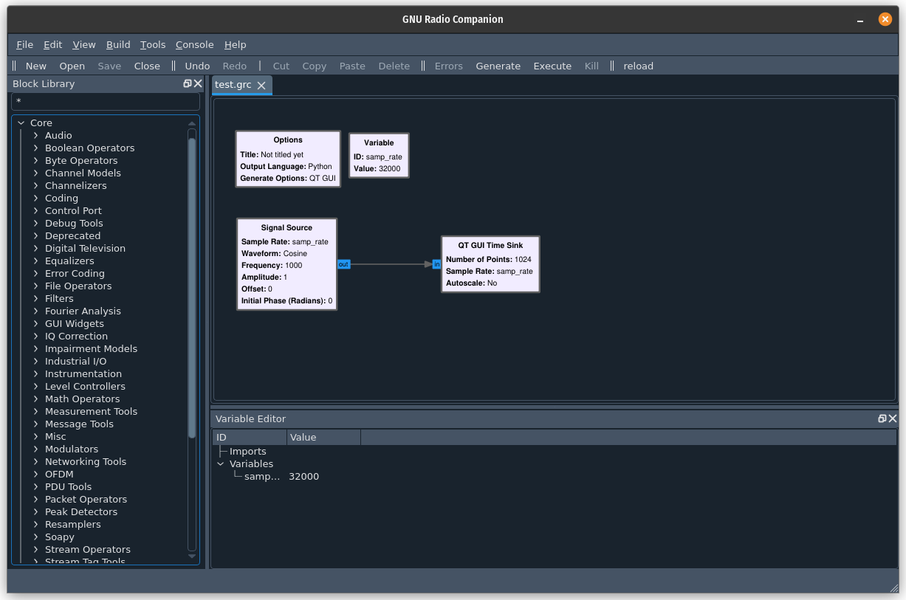
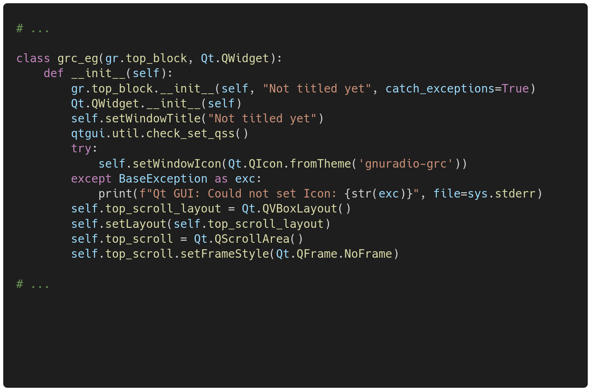
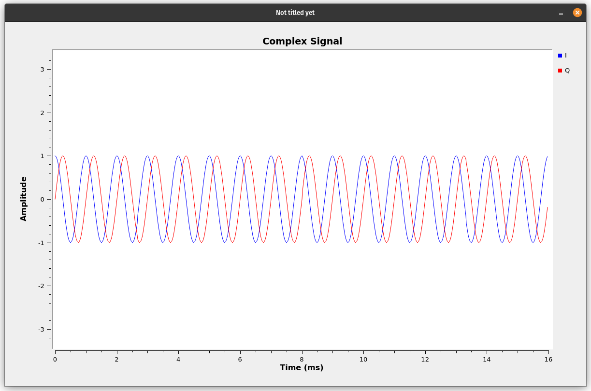

<p align="center">

</p>

[](https://github.com/gnuradio/gnuradio/actions/workflows/make-test.yml)

[](https://github.com/gnuradio/gnuradio/blob/master/COPYING)
[](https://www.gnuradio.org/doc/doxygen/)
[](https://repology.org/project/gnuradio/badges)
[](https://donorbox.org/gnuradio)

# GNU Radio

<table align="center">
    <tr>
        <td>
            
        </td>
        <td>
            
        </td>
        <td>
            
        </td>
    </tr>
</table>

GNU Radio is a free & open-source signal processing runtime and signal processing
software development toolkit. Originally developed for use with software-defined
radios and for simulating wireless communications, it's robust capabilities have
led to adoption in hobbyist, academic, and commercial environments. GNU Radio has
found use in software-defined radio, digital communications, nuclear physics, high-
energy particle physics, astrophysics, radio astronomy and more!

## Helpful Links

* [GNU Radio Website](https://gnuradio.org)
* [GNU Radio Wiki](https://wiki.gnuradio.org/)
* [Github issue tracker for bug reports and feature requests](https://github.com/gnuradio/gnuradio/issues)
* [View the GNU Radio Mailing List Archive](https://lists.gnu.org/archive/html/discuss-gnuradio/)
* [Subscribe to the GNU Radio Mailing List](https://lists.gnu.org/mailman/listinfo/discuss-gnuradio)
* [GNU Radio Chatroom on Matrix](https://chat.gnuradio.org/)
* [Contributors and Affiliated Organizations](https://github.com/gnuradio/gnuradio/blob/main/CONTRIBUTORS.md)

## How to Run the QT Version of GNU Radio Companion

```bash
    # Ensure PyQt5 and other dependencies are installed
    pip install QDarkStyle qtpy
    
    # If you want to run tests
    pip install pytest-qt pyautogui

    # Build and install as usual (described below) and then run
    gnuradio-companion --qt
```

## GNU Radio 4.0

The next major release of GNU Radio, GNU Radio 4.0, is currently under active development. The effort is being spearheaded by FAIR (The Facility for Anti-Proton and Ion Research), part of GSI in Germany. Development of that version is currently taking place under their GitHub organization, [here](https://github.com/fair-acc/gnuradio4).

## How to Install GNU Radio

### Prebuilt Binaries

The recommended way to install GNU Radio on most platforms is using available binary package distributions. 

The following command is for Debian, Ubuntu, and derivatives. Consult your distribution information to obtain the version of GNU Radio which is included.

```
    sudo apt install gnuradio
```

For other operating systems and versions, see [Quick Start](https://wiki.gnuradio.org/index.php/InstallingGR#Quick_Start)

### Ubuntu PPA Installation

For Ubuntu, the latest builds (both released and pulled from master branch) are maintained as PPAs (Personal Package Archives) on [launchpad.net](https://launchpad.net/~gnuradio). **Be sure to uninstall any previously installed versions of gnuradio first.** See [UnInstall GR](https://wiki.gnuradio.org/index.php?title=UnInstallGR#From_Distribution_package_manager_or_PPA).

### Other Installation Methods

Platform-specific guides and Cross-platform guides are described in [Other Installation Methods](https://wiki.gnuradio.org/index.php/InstallingGR#Other_Installation_Methods).

### From Source

Complete instructions for building GNU Radio from source code are detailed in 
[Installing From Source](https://wiki.gnuradio.org/index.php?title=LinuxInstall#From_Source). 

### PyBOMBS

**We are no longer recommending** [PyBOMBS](https://github.com/gnuradio/pybombs#pybombs) **to install modern versions of GNU Radio.**

## Supporting GNU Radio

If you find GNU Radio useful and would like to support its development, you can make a [donation](https://donorbox.org/gnuradio). Your contributions help ensure ongoing improvements and maintenance. Thank you for your support!

## Legal Matters

Some files have been changed many times throughout the years. Copyright 
notices at the top of source files list which years changes have been 
made. For some files, changes have occurred in many consecutive years. 
These files may often have the format of a year range (e.g., "2006 - 2011"), 
which indicates that these files have had copyrightable changes made 
during each year in the range, inclusive.
