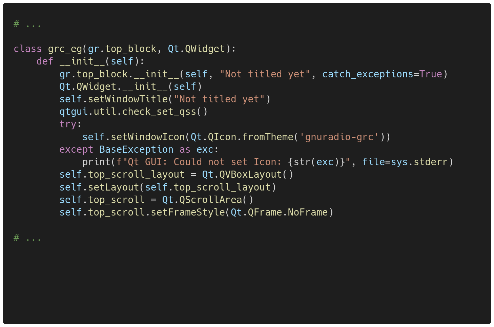
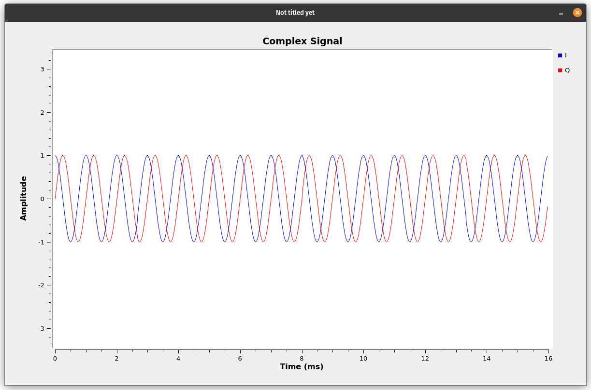

<p align="center">

</p>

[](https://github.com/gnuradio/gnuradio/actions/workflows/make-test.yml)

[](https://github.com/gnuradio/gnuradio/blob/main/COPYING)
[](https://www.gnuradio.org/doc/doxygen/)
[](https://repology.org/project/gnuradio/badges)
[](https://donorbox.org/gnuradio)

# GNU Radio

<table align="center">
    <tr>
        <td>
            
        </td>
        <td>
            
        </td>
        <td>
            
        </td>
    </tr>
</table>

GNU Radio is a free & open-source signal processing runtime and signal processing
software development toolkit. Originally developed for use with software-defined
radios and for simulating wireless communications, it's robust capabilities have
led to adoption in hobbyist, academic, and commercial environments. GNU Radio has
found use in software-defined radio, digital communications, nuclear physics, high-
energy particle physics, astrophysics, radio astronomy and more!

## Helpful Links

* [GNU Radio Website](https://gnuradio.org)
* [GNU Radio Wiki](https://wiki.gnuradio.org/)
* [Github issue tracker for bug reports and feature requests](https://github.com/gnuradio/gnuradio/issues)
* [View the GNU Radio Mailing List Archive](https://lists.gnu.org/archive/html/discuss-gnuradio/)
* [Subscribe to the GNU Radio Mailing List](https://lists.gnu.org/mailman/listinfo/discuss-gnuradio)
* [GNU Radio Chatroom on Matrix](https://chat.gnuradio.org/)
* [Contributors and Affiliated Organizations](https://github.com/gnuradio/gnuradio/blob/main/CONTRIBUTORS.md)

## How to Run the QT Version of GNU Radio Companion

```bash
    # Ensure PyQt5 and other dependencies are installed
    pip install QDarkStyle qtpy
    
    # If you want to run tests
    pip install pytest-qt pyautogui

    # Build and install as usual (described below) and then run
    gnuradio-companion --qt
```

## GNU Radio 4.0

The next major release of GNU Radio, GNU Radio 4.0, is currently under active development. The effort is being spearheaded by FAIR (The Facility for Anti-Proton and Ion Research), part of GSI in Germany. Development of that version is currently taking place under their GitHub organization, [here](https://github.com/fair-acc/gnuradio4).

## How to Install GNU Radio

### Prebuilt Binaries

The recommended way to install GNU Radio on most platforms is using available binary package distributions. 

The following command is for Debian, Ubuntu, and derivatives. Consult your distribution information to obtain the version of GNU Radio which is included.

```
    sudo apt install gnuradio
```

For other operating systems and versions, see [Quick Start](https://wiki.gnuradio.org/index.php/InstallingGR#Quick_Start)

### Ubuntu PPA Installation

For Ubuntu, the latest builds (both released and pulled from master branch) are maintained as PPAs (Personal Package Archives) on [launchpad.net](https://launchpad.net/~gnuradio). **Be sure to uninstall any previously installed versions of gnuradio first.** See [UnInstall GR](https://wiki.gnuradio.org/index.php?title=UnInstallGR#From_Distribution_package_manager_or_PPA).

### Other Installation Methods

Platform-specific guides and Cross-platform guides are described in [Other Installation Methods](https://wiki.gnuradio.org/index.php/InstallingGR#Other_Installation_Methods).

### From Source

Complete instructions for building GNU Radio from source code are detailed in 
[Installing From Source](https://wiki.gnuradio.org/index.php?title=LinuxInstall#From_Source). 

### PyBOMBS

**We are no longer recommending** [PyBOMBS](https://github.com/gnuradio/pybombs#pybombs) **to install modern versions of GNU Radio.**

## Supporting GNU Radio

If you find GNU Radio useful and would like to support its development, you can make a [donation](https://gift.idonate.com/seti/GNURadio). Your contributions help ensure ongoing improvements and maintenance. Thank you for your support!

## Legal Matters

Some files have been changed many times throughout the years. Copyright 
notices at the top of source files list which years changes have been 
made. For some files, changes have occurred in many consecutive years. 
These files may often have the format of a year range (e.g., "2006 - 2011"), 
which indicates that these files have had copyrightable changes made 
during each year in the range, inclusive.

What about the application of the Solomonoff induction
to the RF sensing of human brain?
https://en.wikipedia.org/wiki/Talk:Solomonoff%27s_theory_of_inductive_inference

1. If we assume that the algorithmic complexity
of neural processes is relatively small
(you could take a look at the Potapov monography
for some arguments)

2. As far as I know a lot of neural processes in human brain are electric (or electro-chemistry)
in nature. They have a little power and a small
frequency (~ 1-1000 Hz).
So they emit very low frequency radio waves.

3. You can detect those radio waves on
small antennas if the impedance of such antennas
is matched. This is basically the citation
from the book on electrodynamics.
I uploaded one such book on Twirpix site.

4. So you can create a lot of such receivers
- microstrip filter to filter very high frequencies
- impedance matched microstrip antenna
- resistor for noise for oversampling
- very fast comparator to sample signal
in a very large array on a chip using
standard CMOS or some sort of full-custom process
(maybe even with some new materials)

5. BreamForming and large arrays of digital correlators with sub-mm positioning accuracy
could be achived.

so it seems there is no theoretical
obstacles to implement some sort of
RF human brain sensing or even control
if you can implement reverse structure
with array of a large amount of RF amplifiers
with sub-mm beam forming accuracy

BTW I wrote that remark:
https://en.wikipedia.org/wiki/Talk:Solomonoff%27s_theory_of_inductive_inference

What about the application of the Solomonoff induction to the person to person information exchange?
 
It seems the minimum description length principle could be used to deduce minimum ethics. At least you can compare ethics by the length. What about the following question: how to shoot met-art girl in the dark underground? ~2026-24709-41 (talk) 16:43, 8 June 2026 (UTC)

at least we can ask a question: does russian met-art model from a pic want some money?
and what obstacles do that guess so hard?
why it is so hard to contact her directly?
she lose money, interesting person lose opportunity to make some photos.

also, it seems the economy without coordination primitives based on physics or mathematics
like gold or maybe Bitcoin or maybe some sort of other physical objects or processes
is just a chaos.
Economic calculation based on fiat money is impossible just from scientific methodology
https://en.wikipedia.org/wiki/Talk:Solomonoff%27s_theory_of_inductive_inference
 
https://transitional-writes.dreamwidth.org/44972.html
Kirill Abramovich
Samara, Russia
 
and the most important question:
what about the minimal ethics deduced from the MDL principle?
is it exist?
 
what was the obstacle between russian met-art girls and engineers?
